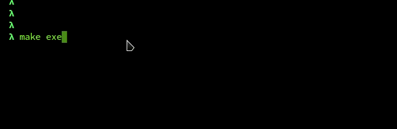

# Turing Machine Visualizer



To visualize turing machines there the app turingmachine.io, on it, to create machines you should use a `yml` file, which is'nt a programming language. So, I created this app to visualize turing machines, which are created in a programming language, this give to you the power to do whathaver machine you want.

Now, the machines is visualized throught the terminal, but, it can be extend to others interfaces. Besides, the language that is used to program is Ocaml, but I have the goal to execute in javascript using [js_of_ocaml](https://ocsigen.org/js_of_ocaml/3.1.0/manual/overview) module, feels free to make these features.  

# Usage

This package use [dune](https://dune.readthedocs.io/en/stable/) as build system. So before run the app, install dune and the dependecies using:

```
$ opam install .
```

Now, build the package and run it:

```
$ dune build

$ dune exec turing
```

This will execute the machine [`write_msg.ml`](/examples/write_msg.ml) because in the main module ([`bin/turingMachineCli.ml`](/bin/turingMachineCli.ml)) was imported your functions. If you want create a machine, you need to create an module in the `examples` directory and use it in the main module. So, change the fallowing code in the main:

```ocaml
module Machine = struct
  include Write_msg (* Change `Write_msg` to the name of your module *)
end;;
```

After it, you can create your machine. To do it, you need to create these tree values:

```ocaml

let machine: (symbol, state) Data.turingMachine = 
  (* Your machine definition *)
;;

let string_of_state : state -> string = 
  (* Function to convert a state to string *)
;;

let string_of_symbol : symbol -> string = 
  (* Function to convert a symbol to string *)
;;

```

The main module will use these three values of your module to show the machine execution in the screen. To see a simple example of machine check the [`repeat_0_1`](/examples/repeat_0_1.ml) machine.

You probably have realized that to create a machine, your need to create a value of the type `('symbol, 'state) Data.turingMachine`. The type `symbol` defines the type of the value of each cell in the tape, and the type `state` defines what is the state of the machine. To better understand these data types, read the generated documentation of the module [`Data`](https://raulpy271.github.io/turingMachine/turingMachine/TuringMachine/Data/index.html). 

Besides, you can also view the [documentation](https://raulpy271.github.io/turingMachine/turingMachine/TuringMachine/index.html) of each module. Feels free to add features, ideas or something great, I will like it :rocket:. 

